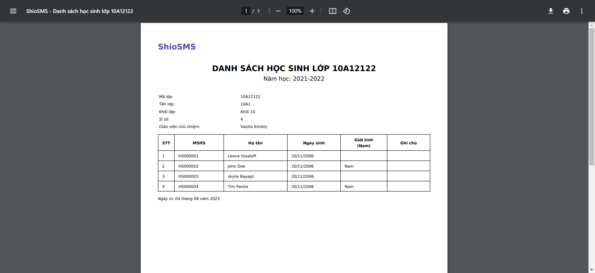

# ShioSMS - Ứng dụng quản lý học sinh

Link demo: [ShioSMS](https://shiobook-ebook-downloader.tech/)

## Actor hệ thống
- Giáo vụ
- Giáo viên
- Học sinh

## Use case Tổng quát

## Use case Actor Giáo vụ

## ERD hệ thống

## Một số hình ảnh của website

### Trang chủ

### Quản lý học sinh

### Danh sách lớp

### Chi tiết lớp học

### Báo cáo thống kê

### Xuất file

